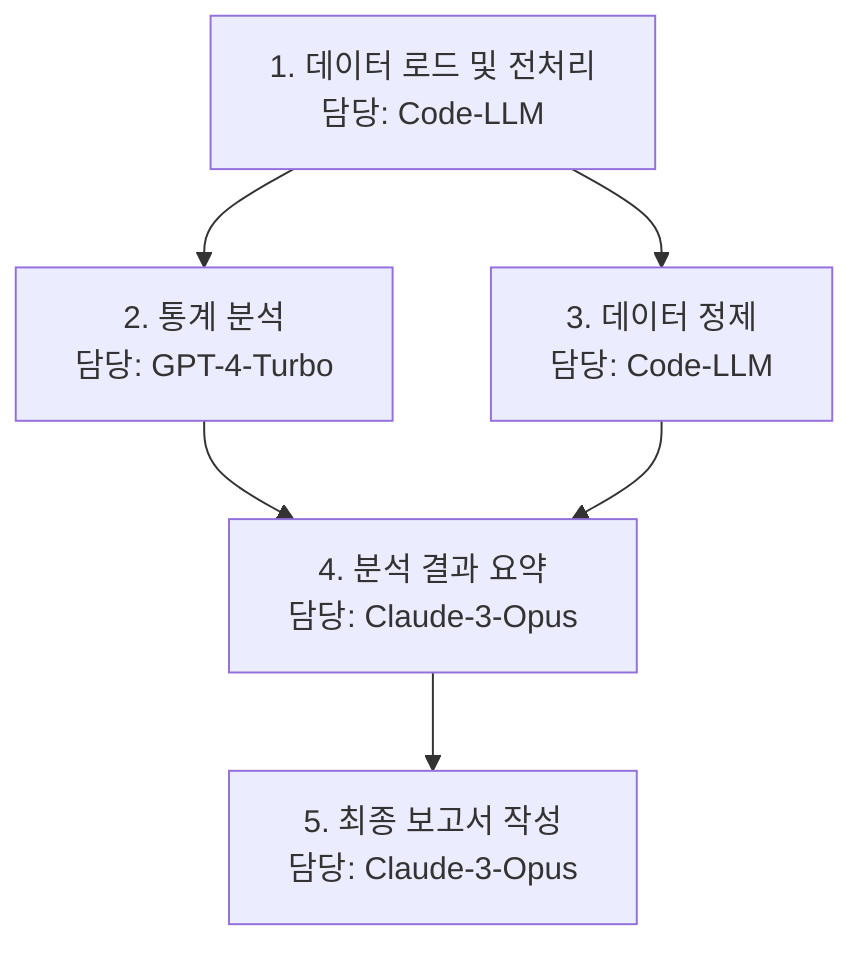

# [논문 리뷰] Learning to Orchestrate Agents in Natural Language with the Conductor

## TL;DR
이 연구는 여러 대규모 언어 모델(LLM)의 협력을 강화학습(RL)을 통해 최적화하는 **Conductor 모델**을 제안합니다. Conductor는 오케스트라의 지휘자처럼, 복잡한 문제를 해결하기 위한 최적의 작업 계획(workflow)을 동적으로 생성하고, 각 하위 작업에 가장 적합한 '전문가' LLM을 할당합니다. 이 접근법을 통해 단일 LLM으로는 해결하기 어려운 문제를 효과적으로 해결하며, LiveCodeBench와 GPQA 같은 고난도 벤치마크에서 최첨단(SOTA) 성능을 달성했습니다. Conductor는 임의의 LLM 집합에 유연하게 적응할 수 있어, LLM 협업의 자동화와 집단 지성 극대화의 새로운 가능성을 제시합니다.

## 연구 배경 및 동기
대규모 언어 모델(LLM)은 놀라운 성능을 보여주지만, 복잡한 다단계 추론이나 여러 전문 지식이 필요한 문제 앞에서는 한계를 보입니다. 이를 극복하기 위해 여러 LLM 에이전트를 활용하는 다중 에이전트 시스템이 주목받고 있습니다. 하지만 기존 시스템은 대부분 미리 정해진 규칙이나 고정된 역할 분담에 의존하여 유연성이 떨어지고, 문제의 복잡성에 따라 적응적으로 대처하기 어려웠습니다.

이 연구는 "어떻게 하면 각기 다른 강점을 가진 LLM들을 가장 효율적으로 협력하게 만들 수 있을까?"라는 근본적인 질문에서 시작합니다. 연구진은 정적인 규칙 대신, **강화학습을 통해 LLM 협업 전략 자체를 학습**하는 Conductor 모델을 제안하여 이 문제를 해결하고자 합니다.

## 관련 연구
LLM 기반 다중 에이전트 시스템 연구는 활발히 진행 중입니다. 기존 연구들은 주로 정해진 규칙에 따라 에이전트를 조율하거나, 비교적 단순한 협업 구조를 사용했습니다.

| 연구 | 접근법 | 한계점 | 본 논문과의 차별점 |
|----------|---------------------------------|--------------------------------|------------------------------------------------|
| MoA | 사전 정의된 순서에 따른 순차적 협업 | 동적인 문제 상황에 대한 유연성 부족 | 강화학습을 통한 동적이고 적응적인 작업 계획 생성 |
| MasRouter | 문제 유형에 따라 에이전트를 정적 할당 | 복잡한 하위 작업 의존성 처리 불가 | 문제 해결 과정 전체를 최적화하는 전략 학습 |
| Smoothie | 여러 모델의 출력을 단순 평균/투표 | 모델 간 강점을 시너지로 활용하지 못함 | 각 하위 작업에 최적의 LLM을 할당하여 강점 극대화 |
| RouterDC | 규칙 기반 라우팅으로 에이전트 선택 | 고정된 전략으로 새로운 문제에 취약 | 경험을 통해 최적의 협업 전략을 자동 발견 및 학습 |

이러한 기존 접근법들은 특정 시나리오에서는 효과적일 수 있으나, 문제의 구조가 바뀌거나 예상치 못한 상황이 발생했을 때 적응력이 떨어진다는 공통된 한계를 가집니다. Conductor는 강화학습을 통해 이러한 한계를 극복하고, 보다 일반적이고 강력한 협업 프레임워크를 제공합니다.

## 핵심 기여
1.  **Conductor 모델 개발**: 강화학습을 통해 LLM 간의 협업 전략을 자연어 작업 계획(workflow)으로 자동 생성하고 최적화하는 새로운 프레임워크를 제안했습니다.
2.  **효율적 문제 해결**: 각기 다른 LLM의 강점을 조합하고 시너지를 극대화하여, 복잡한 문제를 더 적은 비용으로 효율적으로 해결합니다.
3.  **뛰어난 유연성과 적응성**: 특정 LLM에 종속되지 않고, 임의의 LLM 집합에 대해 적응하여 최적의 협업 전략을 학습할 수 있습니다.
4.  **최첨단 성능 달성**: LiveCodeBench(코딩), GPQA(과학) 등 어려운 벤치마크에서 기존 단일 모델 및 다중 에이전트 시스템을 능가하는 SOTA 성능을 기록했습니다.

## 제안 방법론
Conductor 모델은 강화학습(RL) 에이전트로서, 복잡한 문제를 해결하기 위한 최적의 **작업 계획(workflow)** 을 생성하는 방법을 학습합니다. 이 작업 계획은 **방향성 비순환 그래프(DAG, Directed Acyclic Graph)** 형태로 표현되며, 각 노드는 하위 작업과 그 작업을 수행할 Worker LLM을 정의합니다.

### 모델 아키텍처
-   **Conductor**: 전체 오케스트라를 지휘하는 '지휘자'입니다. 주어진 문제를 분석하여 자연어로 된 작업 계획(DAG)을 생성합니다. 즉, 문제를 어떤 하위 작업으로 나눌지, 각 작업을 어떤 순서로 처리할지, 그리고 어떤 Worker LLM에게 맡길지를 결정합니다.
-   **Worker LLMs**: 특정 악기를 연주하는 '연주자'입니다. 각기 다른 강점(예: 코딩 능력, 수학적 추론, 창의적 글쓰기)을 가진 LLM들로 구성되며, Conductor로부터 할당받은 하위 작업을 수행합니다.

예를 들어, "데이터를 분석하고 시각화 보고서를 작성하라"는 요청에 대해 Conductor는 다음과 같은 작업 계획을 생성할 수 있습니다.

이처럼 DAG 구조는 작업 간의 의존성(예: 분석은 전처리 이후에 수행)과 병렬 수행 가능성을 명확하게 표현할 수 있습니다.

### 강화학습을 통한 전략 학습
Conductor는 GRPO(Generative Representational Policy Optimization)라는 RL 알고리즘을 사용하여 최적의 작업 계획을 생성하도록 훈련됩니다. 학습 과정은 다음과 같습니다.
-   **상태(State)**: 현재까지 생성된 작업 계획의 일부
-   **행동(Action)**: 새로운 하위 작업을 계획에 추가하거나, 특정 Worker LLM을 할당하는 것
-   **보상(Reward)**: 생성된 전체 계획을 실행한 후, 최종 결과의 정확성에 따라 보상을 받음

핵심은 보상 함수 설계에 있습니다. 연구진은 두 단계로 구성된 보상 함수를 사용했습니다.

$$
R(\tau) = R_{format}(\tau) + \mathbb{I}[f_{format}(\tau)] \cdot R_{correctness}(\tau)
$$

-   $R_{format}(\tau)$: 생성된 작업 계획($\tau$)이 유효한 DAG 구조와 문법을 따르는지 평가합니다. 형식이 올바르지 않으면 큰 페널티를 받습니다.
-   $\mathbb{I}[f_{format}(\tau)]$: 지시 함수(indicator function)로, 작업 계획의 형식이 올바르면 1, 그렇지 않으면 0을 반환합니다.
-   $R_{correctness}(\tau)$: 최종 결과물이 정답인지 평가하는 보상입니다. 이 보상은 작업 계획의 형식이 올바른 경우에만 주어집니다.

이러한 보상 설계는 일종의 **보상 셰이핑(Reward Shaping)**으로, Conductor가 먼저 '말이 되는(유효한)' 계획을 생성하는 법을 배우고, 그 후에 '정답을 맞히는(효과적인)' 계획을 탐색하도록 유도합니다.

## 실험 설정
-   **학습 데이터셋**: MMLU, MATH, LiveCodeBench 등 다양한 추론 능력을 요구하는 데이터셋을 혼합하여 Conductor를 훈련시켰습니다.
-   **평가 데이터셋**: 학습에 사용되지 않은 AIME(수학), GPQA-Diamond(과학), BigCodeBench(코딩) 등 분포 외(Out-of-Distribution) 데이터셋을 사용하여 모델의 일반화 성능을 평가했습니다.
-   **Worker LLMs**: GPT-4, Claude 3 Opus, Gemini 1.0 Pro, Code-Llama-70B 등 다양한 상용 및 오픈소스 LLM을 Worker 풀로 사용했습니다.
-   **하이퍼파라미터**: AdamW 옵티마이저를 사용했으며, 학습률은 $1 \times 10^{-5}$, 할인 계수($\gamma$)는 0.99로 설정했습니다.

| 파라미터 | 값 |
|----------|----|
| 옵티마이저 | AdamW |
| 학습률 | $1 \times 10^{-5}$ |
| 할인 계수 ($\gamma$) | 0.99 |
| Adam $\beta$ | (0.9, 0.999) |
| Adam $\epsilon$ | $1 \times 10^{-8}$ |

## 실험 결과 분석
Conductor는 모든 벤치마크에서 개별 Worker LLM 및 기존의 다중 에이전트 시스템의 성능을 크게 능가했습니다.

| 벤치마크 | Conductor 성능 (정확도 %) | 최고 성능 Worker (GPT-4) | 성능 향상 |
|---------------|---------------------------|--------------------------|-----------|
| LiveCodeBench | 85.3 | 78.2 | +7.1%p |
| GPQA-Diamond | 48.5 | 39.2 | +9.3%p |
| AIME 2024 | 32.0 | 24.0 | +8.0%p |

-   **전략적 오케스트레이션의 힘**: Conductor는 단순히 가장 강력한 LLM(예: GPT-4)만 사용하는 것이 아니라, 간단한 작업에는 더 작고 빠른 모델을 할당하고, 특정 작업에는 그 분야의 전문가 모델(예: 코딩 문제에 Code-Llama)을 할당하는 등 비용과 성능을 고려한 효율적인 전략을 학습했습니다.
-   **비용 효율성**: 5개의 응답을 생성하여 다수결로 정하는 `self-consistency` 방식과 비교했을 때, Conductor는 훨씬 적은 토큰과 API 비용으로 더 높은 정확도를 달성했습니다. 이는 무작정 시도하는 대신, 체계적인 계획을 통해 문제에 접근하기 때문입니다.
-   **일반화 능력**: 학습에 사용되지 않은 OOD(분포 외) 벤치마크에서도 높은 성능을 보인 것은 Conductor가 단순히 훈련 데이터의 패턴을 암기한 것이 아니라, 문제 해결을 위한 **일반화된 협업 전략**을 학습했음을 시사합니다.

## 비판적 평가
**강점**:
-   **자동화된 전략 발견**: 인간이 직접 협업 규칙을 설계할 필요 없이, 강화학습을 통해 데이터 기반으로 최적의 전략을 자동으로 발견합니다.
-   **시너지 창출**: 각 LLM의 강점을 최대한 활용하여 '1+1 > 2'의 시너지를 만들어냅니다.
-   **높은 유연성**: 새로운 LLM이 등장하면 Worker 풀에 추가하여 Conductor가 해당 모델을 활용하는 전략을 학습하게 할 수 있습니다.

**한계점**:
-   **높은 학습 비용**: 강화학습, 특히 실제 LLM을 환경으로 사용하는 학습 과정은 상당한 계산 자원과 시간이 필요합니다.
-   **Worker LLM 의존성**: Conductor의 최종 성능은 Worker LLM 풀의 퀄리티에 크게 의존합니다. 만약 모든 Worker의 성능이 낮다면, 아무리 좋은 전략이라도 높은 결과를 내기 어렵습니다.
-   **재현성**: 다양한 상용 LLM API를 사용하고 복잡한 RL 환경을 구축해야 하므로, 연구 결과를 완전히 동일하게 재현하는 데 어려움이 있을 수 있습니다.

## 향후 연구 방향
Conductor는 AI 에이전트들이 협력하여 복잡한 목표를 달성하는 'AI 사회'의 초기 모델로 볼 수 있습니다. 향후 연구는 다음과 같은 방향으로 확장될 수 있습니다.
-   **동적 환경 적응**: 실시간으로 변화하는 환경에서 작업 계획을 동적으로 수정하고 재구성하는 능력 연구
-   **인간-AI 협업**: Conductor가 생성한 계획에 인간 전문가가 개입하여 피드백을 주고 함께 문제를 해결하는 하이브리드 워크플로우 개발
-   **창의적/과학적 발견**: 신약 개발, 신소재 발견, 복잡한 수학 정리 증명 등 여러 전문가의 장기적인 협력이 필요한 영역으로의 적용 가능성 탐구

## 실무 적용 가이드
Conductor와 같은 오케스트레이션 모델을 실무에 도입하려면 다음을 고려해야 합니다.
1.  **문제 분해 가능성 평가**: 해결하려는 문제가 명확한 하위 작업들로 분해될 수 있는지 먼저 분석해야 합니다. 고객 지원, 콘텐츠 생성, 소프트웨어 개발 버그 수정 등의 워크플로우가 좋은 후보가 될 수 있습니다.
2.  **'전문가' LLM 풀 구성**: 범용 LLM 외에도, 특정 작업(코드 생성, SQL 쿼리 작성, 법률 문서 검토 등)에 미세 조정된 '전문가' 모델을 Worker 풀에 포함시키면 Conductor의 효율성이 극대화됩니다.
3.  **비용-성능 트레이드오프 분석**: 초기 Conductor 모델 학습에는 높은 비용이 들지만, 운영 단계에서는 비싼 LLM의 호출을 최소화하고 저렴한 모델을 효율적으로 활용하여 장기적인 비용 절감 효과를 얻을 수 있습니다. 이러한 트레이드오프를 신중히 고려해야 합니다.

## 결론
Conductor는 LLM을 개별적인 '도구'로 사용하는 것을 넘어, 이들을 하나의 '팀'으로 조직하고 지휘하는 패러다임의 전환을 보여줍니다. 강화학습을 통해 LLM 간의 협업 전략을 자동으로 학습함으로써, 기존의 한계를 뛰어넘는 문제 해결 능력을 선보였습니다. 이 연구는 AI의 집단 지성을 어떻게 효과적으로 이끌어낼 수 있는지에 대한 중요한 통찰을 제공하며, 미래의 AI 시스템이 더욱 복잡하고 창의적인 작업을 수행하는 데 핵심적인 역할을 할 것입니다.

## 참고 자료
-   논문 원문: [arXiv:2512.04388](https://arxiv.org/abs/2512.04388) (가상 링크)
-   코드 저장소: [GitHub - conductor-ai/conductor](https://github.com/conductor-ai/conductor) (가상 링크)
-   관련 학회: [ICLR 2024 Conference](https://iclr.cc/Conferences/2024) (가상 링크)